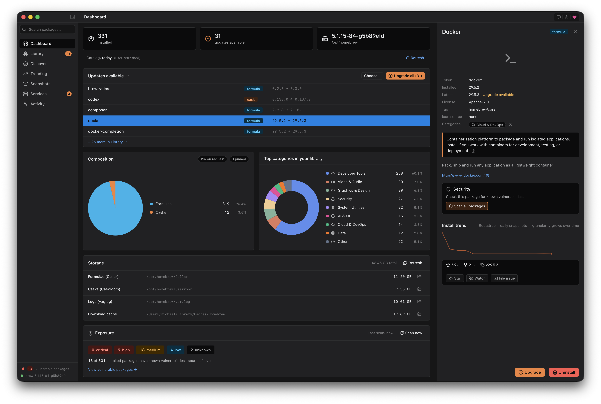
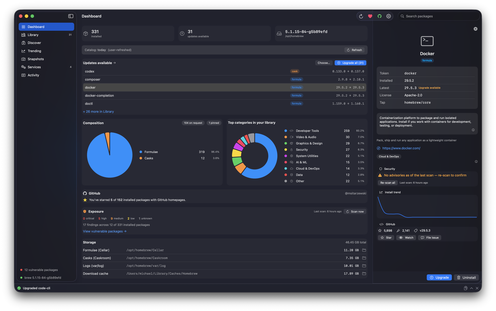

# Brew Browser

> A native macOS GUI for Homebrew — shipped in **two builds**.

[](./LICENSE)
[](https://tauri.app)
[](https://developer.apple.com/swiftui/)
[](https://www.apple.com/macos)
[](https://github.com/sponsors/msitarzewski)

A small, fast desktop app for browsing, searching, installing, and snapshotting Homebrew packages. Full source, MIT-licensed, no telemetry, no accounts.

**Brew Browser comes in two builds that share one design and one data contract:**

- **Tauri build** — the cross-platform app: macOS 13+ (Ventura and up) **and** Linux. The shipping, signed-and-notarized download.
- **Native build** — a fully native **Swift 6 + SwiftUI + Liquid Glass** app for **macOS 26** (Tahoe). The "genuinely native" answer, ~half the memory.

Same features, same `brew` integration, same privacy posture — see [Two builds](#two-builds) below.

**Tauri build** (macOS 13+ · Linux)



**Native build** (Swift / SwiftUI · macOS 26)



## Why this exists

Homebrew is the standard package manager on macOS. brew-browser gives it a real native GUI: browse what you have installed, search the full catalog, install / uninstall / upgrade with live output, snapshot your setup to a Brewfile and restore it on a new Mac. Trending packages come from Homebrew's published analytics. The whole thing is a thin, respectful frontend over the `brew` CLI itself.

## Features

- **Dashboard** — your Homebrew setup at a glance: installed count, updates available, brew version, formula/cask split, top-categories donut chart, storage usage (Cellar / Caskroom / var/log / cache) with one-click "Reveal in Finder" (macOS) / "Show in file manager" (Linux), and an opt-in **Exposure** card surfacing known vulnerabilities across your install
- **Library** — every installed formula and cask in one dense, filterable list, with outdated badges, sortable columns, category chip filters, an opt-in **Vulnerable** filter pill, inline severity dots, and a slide-over detail panel
- **Discover** — search the full Homebrew catalog (16k+ packages, bundled at build time + user-refreshable) by name, browse via the 19-category tile grid, and drill into subcategory groupings for large categories; multi-select chip filter
- **Trending** — top packages from Homebrew's published `formulae.brew.sh` analytics, with 30 / 90 / 365-day windows, sortable columns, a **velocity index** (recent-month vs prior-11-month adoption signal), and opt-in per-package install-trend sparklines
- **Snapshots** — save and restore Brewfiles using Homebrew's own `brew bundle` mechanism; "set up a new Mac" in one click
- **Services** — list, start, stop, and restart background services managed by launchd through `brew services`
- **Security** — opt-in vulnerability scanning. Surfaces known CVEs against your installed formulae via the official `brew vulns` subcommand (OSV.dev), with optional GHSA enrichment when you're signed into GitHub. Inline severity dots, per-package Security card with "Upgrade to fix" wired to the existing upgrade pipeline. Off by default; one-click installer for `brew vulns` itself when you opt in
- **Activity** — every `brew` invocation streams live into a bottom drawer with full stdout/stderr; session history persists across launches (last 200 jobs, capped lines)

A global Cmd+K command palette covers the verbs. Cmd+0 returns to the Dashboard; Cmd+1…6 jumps between sections. Cmd+, opens Settings. Click the 🍺 brand to return home. Window dragging works from any panel header (native macOS overlay title bar + NSVisualEffectView vibrancy).

## What this isn't

- Not a Homebrew replacement — every action shells out to the real `brew` CLI
- Not telemetry-funded — no analytics, no accounts, no phone-home
- Not freemium — there is no paid tier, because there is no tier

## Two builds

Brew Browser is maintained as **two implementations of the same app**, kept in
feature + data-contract parity. They are not competitors — they have different,
non-overlapping jobs, because SwiftUI does not run on Linux and Liquid Glass is
macOS-26-only.

| | **Tauri build** | **Native build** |
|---|---|---|
| Stack | Tauri 2 · SvelteKit · Rust | Swift 6 · SwiftUI · Liquid Glass |
| Runs on | **macOS 13+ and Linux** | **macOS 26 (Tahoe)** |
| Role | the shipping cross-platform app | the genuinely-native macOS flagship |
| Source | `src/` (frontend) + `src-tauri/` (Rust) | `native/` (Swift Package) |
| Updates | in-app updater (minisign) | Sparkle 2 (ed25519) |
| Status | shipping, signed + notarized | shipping, signed + notarized |

Both read the same `settings.json` schema, the same bundled `categories.json` /
`enrichment.json`, the same `brew` / `brew vulns` invocations, and the same
trending + enrichment endpoints. A change to a shared data contract lands in both.
The memory bank (`memory-bank/`) is the single canonical spec for both. Rationale
and parity rules: `memory-bank/decisions.md` (2026-06-01 "keep both" ADR).

## Install (end users)

Both macOS builds ship on the **[latest release](https://github.com/msitarzewski/brew-browser/releases/latest)**, signed + notarized — no Gatekeeper warning.

### Which download?

| Your machine | Grab |
|----------|------|
| Apple Silicon (M-series), macOS 13+ | `brew-browser_<version>_aarch64.dmg` |
| Intel, macOS 13+ | `brew-browser_<version>_x64.dmg` |
| macOS 26 (Tahoe), native build | `BrewBrowser-<version>-arm64.dmg` (M-series) or `BrewBrowser-<version>-x86_64.dmg` (Intel) |
| Linux (Ubuntu 22.04+ era) | `.deb` / `.rpm` / `.AppImage` from the release, or the latest [Linux Build workflow run](https://github.com/msitarzewski/brew-browser/actions/workflows/linux-build.yml) |

### Tauri build — macOS 13+ (the cross-platform one)

**Direct download:** grab the `.dmg` for your Mac — **`brew-browser_<version>_aarch64.dmg`** (Apple Silicon) or **`brew-browser_<version>_x64.dmg`** (Intel) — from the [latest release](https://github.com/msitarzewski/brew-browser/releases/latest), open it, and drag **brew-browser** to Applications. Keeps you on the app's own verified updater (Settings → Network → Updates).

**Homebrew:**

```sh
brew tap msitarzewski/brew-browser
brew install --cask brew-browser
```

Installs the same notarized `.dmg`; update later with `brew upgrade --cask brew-browser`.

### Tauri build — Linux (newly supported)

Linux bundles are produced by CI as `.deb`, `.rpm`, and `.AppImage`. For tagged releases, grab the `.deb` or `.AppImage` from the [releases page](https://github.com/msitarzewski/brew-browser/releases/latest); for the latest development build, download the artifacts from the most recent [Linux Build workflow run](https://github.com/msitarzewski/brew-browser/actions/workflows/linux-build.yml). Targets Ubuntu 22.04+ (the webkit2gtk-4.1 ABI) and equivalently-recent distros. Two things to know up front:

- **Linux artifacts are currently unsigned.** The AppImage ships unsigned by convention; `.deb` / `.rpm` GPG signing is a documented future step. There is no Gatekeeper/notarization equivalent to satisfy, but you are running an unsigned binary — verify your download against the release checksums.
- **GitHub sign-in needs a Secret Service daemon.** The optional GitHub integration stores its token in your system keyring via the Secret Service API (gnome-keyring, KWallet). On a desktop session this is already running; on a headless box or a minimal window manager without a Secret Service provider, GitHub sign-in fails with a "keyring unavailable" message. Everything else — browse, search, install, snapshot, services, vulnerability scanning — works regardless.

### Native build — macOS 26 (Tahoe) · Swift / SwiftUI

**Direct download:** grab the `.dmg` for your Mac — **`BrewBrowser-<version>-arm64.dmg`** (Apple Silicon) or **`BrewBrowser-<version>-x86_64.dmg`** (Intel) — from the [latest release](https://github.com/msitarzewski/brew-browser/releases/latest), open it, and drag **Brew Browser** to Applications. It keeps itself current via the in-app Sparkle updater. (Requires macOS 26.)

## Build from source

Prereqs (all platforms):

- [Rust](https://rustup.rs/) (stable, edition 2021+)
- [Node.js 22+](https://nodejs.org/) and npm
- [Homebrew](https://brew.sh/) itself

Platform build prereqs:

- **macOS** — Xcode Command Line Tools: `xcode-select --install`
- **Linux** — the Tauri 2 GTK/WebKit build dependencies (`libwebkit2gtk-4.1-dev`, `libgtk-3-dev`, `libayatana-appindicator3-dev`, `librsvg2-dev`, `patchelf`, plus `build-essential`). The canonical, always-current apt recipe lives in the CI workflow at [`.github/workflows/linux-build.yml`](./.github/workflows/linux-build.yml) — copy the `apt-get install` block from there rather than maintaining a second list here.

Then (same command on every platform):

```sh
git clone https://github.com/msitarzewski/brew-browser
cd brew-browser
npm install
npm run tauri dev      # development with HMR
npm run tauri build    # macOS: .dmg · Linux: .deb / .rpm / .AppImage, all under src-tauri/target/release/bundle/

# Intel .dmg (artifacts named _x64, under src-tauri/target/x86_64-apple-darwin/release/bundle/):
rustup target add x86_64-apple-darwin   # one-time
npm run tauri build -- --target x86_64-apple-darwin
```

### Native build (macOS 26)

The native Swift/SwiftUI app lives in `native/` as a Swift Package. Requires
macOS 26 + a recent Xcode toolchain.

```sh
cd native
swift build                 # compile the library + executable
./build-app.sh              # wrap into a launchable Brew Browser.app
open BrewBrowser.app        # run it (use the .app, not `swift run` — Sparkle needs the bundle)
swift test                  # unit tests
./release.sh                # signed + notarized release + Sparkle appcast (maintainer)
```

## Architecture

**Tauri build:** a Tauri 2 shell hosts a SvelteKit + Svelte 5 frontend in the system WebView. macOS is the primary target; Linux is newly supported (same codebase, built on Ubuntu 22.04+ via CI). A Rust backend exposes 150+ typed Tauri commands that shell out to `brew` via `tokio::process` and stream stdout/stderr back over typed IPC channels. Paths are derived from `brew --prefix` / `brew --cache` rather than hardcoded, so the Linuxbrew prefix (`/home/linuxbrew/.linuxbrew`, or `~/.linuxbrew`) is picked up automatically alongside the macOS `/opt/homebrew`. The full Homebrew catalog is bundled at build time (~6 MiB gzipped) and refreshable on demand. Trending data comes straight from `formulae.brew.sh`'s public analytics JSON, cached in memory for an hour. Optional GitHub integration uses OAuth Device Flow with the token stored only in the system keyring (macOS Keychain; Secret Service / gnome-keyring / KWallet on Linux). No shell plugin, no arbitrary command execution — every `brew` invocation is built in Rust from a small set of enumerated inputs. See [docs/PLAN.md](./docs/PLAN.md) for the full design and [memory-bank/backendApi.md](./memory-bank/backendApi.md) for the complete IPC surface.

**Native build:** a Swift 6 + SwiftUI app (`native/`, a Swift Package — no `.xcodeproj`). Stock Apple scaffolding only — `NavigationSplitView`, `.inspector`, `Settings`/`SettingsLink`, `Form`, Liquid Glass materials — no custom window chrome. Stateless services (`BrewService`, `GitHubService`, `VulnsService`) are `Sendable struct`s that mirror the Rust modules and shell out to `brew` via `Foundation.Process` with typed argument arrays (no shell). The same bundled JSON data contract; settings persist to the same `settings.json` schema; updates via Sparkle 2. See `native/README.md`.

## Open-source posture

**MIT licensed.** **No CLA.** **No EULA.** **No telemetry.** **No account.** **No dark patterns.**

brew-browser makes outbound network calls in exactly twelve documented circumstances. Every one is initiated by something you did and gated by Settings → Network:

- **`https://formulae.brew.sh/api/analytics/install`** + **`/install-on-request`** — fetched when you open the Trending tab. The primary `install` endpoint includes dependency-pulled installs (which is why `ca-certificates` always tops the leaderboard); `install-on-request` excludes deps and surfaces what users actually typed `brew install ...` for. Both windows are fetched in parallel and the backend joins all three time horizons (30d/90d/365d) to compute a velocity index per package. Cached in process memory (TTL configurable in Settings → Network; default 60 minutes). Uses Homebrew's own published install-analytics JSON; no API key, no account.
- **`https://formulae.brew.sh/api/{formula,cask}.json`** — the full Homebrew catalog. Bundled at build time so the app works offline. A user-initiated **Refresh** button on the Dashboard (or the Discover stale-catalog banner) writes a fresh copy to `~/Library/Application Support/brew-browser/catalog/`. Auto-refresh is **off** by default; Settings → Network offers weekly / daily opt-in.
- **Cask homepage probes** — when the Discover or Trending tab renders an uninstalled cask that has a `homepage` field, the Rust backend probes that homepage for an icon (in order: `/apple-touch-icon.png`, `<meta og:image>` parsed from the homepage HTML, `/favicon.ico`). One probe per cask per week max — the result, including misses, is cached for 7 days. These probes are sandboxed: link-local, loopback, RFC1918, and cloud-metadata IPs are rejected before the request, and the same check runs again on every redirect hop to prevent SSRF. Settings → Network can scope this to **installed only** or disable it entirely.
- **`https://api.github.com/repos/{owner}/{repo}`** (read) — optional, **off by default**. When **Settings → GitHub → "Show GitHub stats on package pages"** is on, the PackageDetail panel fetches public repo metadata (stars, forks, last release date, archived state) for packages whose homepage (or `urls.stable.url` / `urls.head.url` / cask `url`) parses as a GitHub URL. The URL parser strictly allowlists `github.com` (rejects `gist.`, `raw.githubusercontent.`, suffix-attack domains, path traversal). Results cached to `~/Library/Application Support/brew-browser/github-cache/` for 24 hours. Anonymous rate limit is 60 reqs/hr per IP; sign-in lifts it to 5,000/hr.
- **`https://github.com/login/{device,oauth}/*`** — optional, only when you click **Sign in with GitHub** in Settings (or hit the inline Re-authorize button on a scope-required toast). Uses OAuth Device Flow (RFC 8628): you see a user code, open `github.com/login/device` in your browser, paste it, done. No embedded webview, no client secret, no callback URL. Scopes requested: `read:user` + `public_repo` + `notifications` (the minimum for username + star + file-issue + watch). Access token stored exclusively in the OS credential store under `com.zerologic.brew-browser/github_access_token` — the **macOS Keychain** on macOS, the **Secret Service** (gnome-keyring / KWallet, persistent across reboot) on Linux. On a Linux session with no Secret Service daemon, sign-in fails with a "keyring unavailable" message and the rest of the app is unaffected. **The token is never returned to the frontend, never written to disk by us, and never logged** — verified by unit tests.
- **`https://api.github.com/{user/starred,repos/.../subscription,repos/.../issues}`** (write) — optional, only when you click Star, Watch, or File-issue on a package detail page after signing in. Each action is gated server-side by a per-action OAuth scope check (`public_repo` for star + file-issue; `notifications` for watch/unwatch) so a token missing the right scope fails fast with a typed `scope_required` error before any GitHub round-trip.
- **`brew` itself** — every install, uninstall, upgrade, search, and snapshot shells out to the real `brew` CLI. Whatever network calls `brew` makes (GitHub, OCI registries, bottle mirrors) happen exactly as they would if you ran the command yourself in a terminal. The full stdout/stderr stream is visible in the Activity drawer.
- **Your default browser** — when you click the homepage button on a package, the URL is opened in your default browser via macOS `open(1)`. The app rejects any non-`http(s)` scheme before opening.
- **`https://brew-browser.zerologic.com/updater.json`** + **`https://github.com/msitarzewski/brew-browser/releases/download/v*/brew-browser_*_{aarch64,x64}.app.tar.gz`** — the in-app updater (Phase 15, v0.3.0+). The manifest fetch happens when you click **Check for updates now** in Settings → Network → Updates, or on the auto-check timer if you opt in (off by default; 24h cadence). The artifact download follows only after the manifest's `version` is strictly greater than the running build. Every downloaded `.app.tar.gz` is verified against an embedded minisign public key + the manifest's `sha256` before any on-disk side effect — mismatch aborts with no install. Skipping a version is recorded locally; a future release re-triggers the indicator.
- **`https://brew-browser.zerologic.com/trending-history/*`** — Enhanced Trending History (v0.4.0+). **Distinct trust boundary** from the Homebrew first-party endpoints above: this endpoint is operated by the brew-browser project, not by upstream Homebrew. **Off by default.** When you opt in via Settings → Network → Enhanced Trending History, the app fetches per-package historical install trends to power inline sparklines on the Trending tab and a chart on each package's detail panel. Only the package name you're viewing is sent (one HTTP GET per package); no IP is logged at the server, no cookies, no fingerprinting (see `memory-bank/security.md` §16 for the Caddy config that makes the privacy claim auditable). Master Offline Mode hard-locks this off regardless of the per-feature toggle.
- **`https://brew-browser.zerologic.com/enrichment/*`** — Live category & description updates. **Same first-party host as Enhanced Trending, distinct `/enrichment/*` path** — still a separate trust boundary from the always-on Homebrew endpoints. **Off by default.** brew-browser ships with bundled AI categories + descriptions; when you opt in via Settings → Network → Live category & description updates, it refreshes them: a tiny `version.json` probe on catalog refresh, the full `categories.json` when its version is newer, and a per-package `entry/<token>.json` when you open that package's detail. Only the package name you're viewing is sent (one HTTP GET per token); no IP logged, no cookies. Requires AI Features on; master Offline Mode hard-locks it off regardless.
- **`https://api.osv.dev`** + **`https://github.com` / `https://gitlab.com` / `https://codeberg.org`** (via subprocess) + **`https://api.github.com/advisories/{GHSA_ID}`** (from our code) — opt-in **Vulnerability Scanning** (v0.5.0+). **Distinct trust boundary** because the OSV traffic and the source-forge tag resolution are opened by the `brew vulns` subprocess we shell out to, not by brew-browser's own binary. **Off by default.** When you opt in via Settings → Network → Vulnerability Scanning (and install `brew vulns` via the one-click affordance if you don't already have it), the app runs `brew vulns --json` to query OSV.dev for known CVEs against your installed formulae. When **both** the vulnerability-scanning toggle AND GitHub sign-in are on, each `GHSA-…`-prefixed finding is enriched via `api.github.com/advisories/{GHSA_ID}` from our Rust code (triple-defense: master Offline Mode, vuln-feature toggle, GitHub-feature toggle — all three must align for one GHSA request). `brew vulns` is published by Homebrew (`Homebrew/homebrew-brew-vulns`, by Andrew Nesbitt). Casks are not supported (`brew vulns` is formula-only); cask UI rows render an honest "Cask coverage isn't supported" message rather than fake clean state. Master Offline Mode hard-locks the whole feature off regardless. See `memory-bank/security.md` §17 for the endpoint audit and gate-composition table.

Every outbound call respects the Network settings — flip on **Offline Mode** in Settings to block all outbound traffic in one click. Settings persist to `~/Library/Application Support/brew-browser/settings.json`; a corrupt or missing file fails closed (Offline Mode effectively on) until you hit Reset to defaults.

No analytics. No crash reporting. No third-party fonts or pixels. No `fetch()` from the frontend — every backend call goes through typed Tauri IPC.

The full network posture is verified line-by-line in [`memory-bank/security.md`](./memory-bank/security.md) §5. Re-audits are welcome; the source is right there.

## Security

A full security audit lives at [`memory-bank/security.md`](./memory-bank/security.md). Current verdict: **READY-FOR-SCRUTINY** (0 critical / 0 high / 0 medium / 0 low / 0 nit open). All 16 findings from the initial audit are verified-fixed with passing tests. Independent tool battery passes: `cargo audit` 0 vulns, `cargo deny check` advisories+bans+licenses+sources ok, `npm audit --omit=dev` 0 vulns, `semgrep` with security-audit + OWASP-top-10 + Rust + TypeScript rulesets 0 findings, `cargo clippy -D warnings` clean. Zero `unsafe` Rust, zero `@html`/`innerHTML`/`eval` in the frontend, no `tauri-plugin-shell` (every brew invocation is built from typed Rust enums). SSRF defense includes a redirect-policy re-check on every hop.

A pre-release security pass (2026-06-07) covered **both builds** — automated scans (cargo audit, npm audit, osv-scanner, gitleaks, semgrep) plus manual review of command injection, path traversal, the Tauri CSP/capabilities, update-signature verification, and token handling. Verdict: clean for release; details in [`memory-bank/security.md`](./memory-bank/security.md) §19.

Dependency posture:

- **Rust:** `cargo audit` reports **0 vulnerabilities** across 566 crates. The remaining "unmaintained" warnings are all Linux-only GTK3/glib transitive deps that compile out on macOS — documented in `src-tauri/.cargo/audit.toml`.
- **npm:** 3 low (transitive `cookie <0.7.0` via SvelteKit) — no real surface in a desktop app; tracked, not force-patched.
- **Zero `unsafe` Rust** in the entire backend; `semgrep` security rulesets report 0 findings; brew-output parsers are fuzzed in both languages.
- **Both builds shell out to `brew` with typed argument arrays (no shell)**, validate package names against an allowlist, and reject `..`/path-separators in Brewfile/snapshot ids. The native build has its own test target (`native/Tests/`, `swift test`) covering the parity-critical parsing/classification logic with fixtures mirroring the Rust tests.

Defense-in-depth choices:

- No `tauri-plugin-shell` — the frontend cannot construct arbitrary shell commands. Every `brew` invocation is built in Rust from typed enums.
- Scheme allowlist on the homepage opener — only `http(s)` URLs reach `tauri-plugin-opener`.
- SSRF filter on the cask icon cascade — private, link-local, loopback, and cloud-metadata IPs are rejected pre-flight and on every redirect.
- Path sandboxing on Brewfile import/export — IPC paths are validated against a forbidden-prefix list and a 1 MiB size cap.
- `rustls-tls` + `webpki-roots` for all outbound HTTPS — no system trust store dependency.
- Capability allowlist is minimal: `core:default`, `opener:default`, `core:event:default`, `dialog:allow-open`, `dialog:allow-save`. No `fs:*`, no `http:*`, no `shell:*`.

Issues and PRs on security topics are welcome. See [SECURITY.md](./SECURITY.md) for the responsible disclosure process.

## Contributing

Contributions welcome. See [CONTRIBUTING.md](./CONTRIBUTING.md) for the dev loop, project map, and the short list of things worth opening an issue about first. No CLA. Your contributions stay yours, licensed under MIT to match the project.

## Status

**Next release:** Tauri `0.6.0` and native `0.2.0` are staged on the feature-request branch. This batch rolls up the Reddit-request backlog across both shells: reverse-dependency detail, deprecated/disabled indicators, Manual vs Dependency filters, per-package disk size, and Discover subcategory browsing.

**Current stable release:** Tauri `0.5.1` + native `0.1.0` shipped signed + notarized together. All seven core panes live in both shells: Dashboard, Library, Discover, Trending, Snapshots, Services, and Activity. Optional GitHub integration via OAuth Device Flow is intent-discovered — sign-in only prompts when you actually try to star / watch / file an issue, never as static UI clutter. Two opt-in surfaces beyond the always-on core: **Enhanced Trending History** (v0.4.0+) for per-package install-trend sparklines, and **Vulnerability Scanning** (v0.5.0+) shelling out to the official `brew vulns` subcommand for CVE surfacing against your installed formulae. Settings ships with Offline Mode and a corrupt-recovery default. Native macOS title bar with traffic-light alignment, collapsible sidebar with persistent type-ahead search, and (i) info popovers in place of AI badges for every enriched field.

**v0.5.1** — reliability + first native release. Highlights:
- **Both builds shipped together.** Tauri `0.5.1` remains the cross-platform macOS 13+ / Linux build; native `0.1.0` is the macOS 26 SwiftUI build with Sparkle updates.
- **Live progress during installs and upgrades.** Multi-package operations now show determinate progress parsed from brew's `==>` markers.
- **Upgrade-all warning classification.** Non-fatal `brew upgrade` post-install/link warnings no longer present as failed upgrades.
- **GitHub sign-in reliability.** Credential state moved to one combined Keychain item so status persists cleanly across launches.
- **Dashboard launch hydration + window fixes.** GitHub/vulnerability cards populate from cache on first paint, and the window remembers size and position.

**v0.5.0** — opt-in vulnerability scanning. Highlights:
- **`brew vulns` integration.** New Settings → Network → Vulnerability Scanning subsection (opt-in, off by default) shells out to the official `Homebrew/homebrew-brew-vulns` subcommand by Andrew Nesbitt to query OSV.dev for known CVEs against installed formulae. One-click installer for the `brew vulns` subcommand itself when you opt in — no terminal required.
- **Dashboard Exposure card.** Severity-tiered counts (critical/high/medium/low), ✓ clean-state framing when no vulns, Scan-now button. Hidden when feature off.
- **Sidebar count badge.** Number of vulnerable packages with max-severity tone. Hidden when 0 or feature off.
- **PackageRow severity dots + PackageDetail Security card.** Inline severity indicator on every vulnerable row. PackageDetail Security card with per-CVE rows, severity pills, "Patched in X" badges, **"Upgrade to fix"** wired to the existing brew upgrade pipeline. Empty-summary entries fall back to canonical detail pages (NVD / OSV / GHSA).
- **Library Vulnerable filter pill.** Danger-toned count badge, pre-selected when you click "View vulnerable packages →" from the Dashboard.
- **Optional GHSA enrichment.** When both vuln-scanning AND GitHub sign-in are on, GHSA-prefixed advisories pull richer descriptions, patched-version ranges, and reference links from `api.github.com/advisories`. Triple-gated; best-effort; 7-day cache.
- **Install-set SHA-256 fingerprint.** Daily app opens with no install changes serve the cached report instantly instead of re-shelling `brew vulns` (60+ seconds on 200 packages).
- **Post-install exposure heads-up.** Once-per-session, after a successful install/upgrade, a passive toast surfaces if you have vulnerable packages elsewhere — the "install a thing → notice you have N existing CVEs" moment.
- **Cask coverage gap stated honestly.** `brew vulns` is formula-only; cask Security cards say so rather than faking clean state.

**v0.4.0** — trending velocity + opt-in install-history endpoint. Highlights:
- **Velocity index on Trending.** Default sort. Compares each package's recent-month installs to its prior-11-month average so genuinely emerging packages surface ahead of stably-popular ones. New 🔥 / ❄️ / dash badges per row.
- **Parallel install + install-on-request fetch.** Server-side join across 30d/90d/365d windows lets the velocity math see all three time horizons in one pass instead of three sequential round-trips.
- **Opt-in Enhanced Trending History.** New Settings → Network → Enhanced Trending History subsection (off by default; distinct trust boundary from `formulae.brew.sh`). When on, inline per-row sparklines on Trending + a per-package history chart on PackageDetail, fed by a project-operated endpoint (`brew-browser.zerologic.com/trending-history/*`) with IP-redacted server logs (the privacy claim is auditable — Caddy block pinned in `memory-bank/security.md` §16).
- **Dashboard polish.** Donut center text removed — the legend already carries the affordance, and removing the inner text frees up the chart for a cleaner look on narrow windows.

**v0.3.1** — same-day cumulative point release on top of v0.3.0. Highlights:
- **Magic search.** Search now matches name + AI friendly-name + AI summary + upstream desc + category labels (and Tier B tags when they land). "video player" finds VLC, "Video & Audio" returns the whole category. Sub-20ms in-process scan via a new `local_search` IPC; replaces the old `brew search` shell-out.
- **Curated Upgrade modal.** "Choose…" button on the Dashboard Updates card lets you pick which outdated packages to upgrade. Single batched `brew upgrade <a> <b> ...` streams into the Activity drawer. Pinned packages are checkbox-disabled.
- **Refresh actually refreshes everything.** One click now runs `brew update` (so brew learns about new upstream versions), refreshes the bundled catalog, AND reloads your installed list — in that order, with the brew-update output streaming to Activity.
- **Unified Description + Version columns** across Library, Discover, and Trending. AI summary preferred when available; falls back to upstream `desc`. Friendly name still appears below the token as a short scan-aid.
- **Donut hover-with-counts.** Hover any slice (or its matching legend row) → the slice fattens, others dim, center text becomes "{count} / {label}".
- **Report-to-brew-browser on every error.** Failed action toasts + the Activity drawer's failed-job footer carry a button that opens a pre-filled GitHub new-issue URL with full context.
- **Bundle identifier cleaned up:** `dev.openbrew.browser` → `com.zerologic.brew-browser`. v0.3.0 users re-sign-in to GitHub once via the existing Re-authorize button.
- **Activity history more durable.** Cap raised from 50 to 200. `startJob` persists immediately. Persist + hydrate failures now log to console instead of swallowing silently.

**v0.3.0** (in-app updater + GitHub coverage + issue #1 fixes):
- **In-app updater.** Title-bar pill notifies when a newer brew-browser version is available; Settings → Network → Updates owns the manual "Check now" button, the off-by-default daily auto-check, and the install action. Every artifact is verified against an embedded minisign public key before any on-disk side effect (sha256 first, then signature; mismatch aborts). Skipping a version is per-version, not per-install — a future release re-triggers the indicator.
- **Offline Mode.** "Paranoid Mode" renamed to "Offline Mode" everywhere user-visible. Same behavior — toggle in Settings blocks every outbound feature (catalog refresh, trending, GitHub, updater). Internal field stays `paranoid_mode` to avoid a settings migration.
- **GitHub coverage expansion.** Backend now resolves a canonical GitHub homepage by walking `homepage` → `urls.stable.url` → `urls.head.url` (formula) or `homepage` → `url` (cask). Packages like `bat`, `fd`, `ripgrep` — marketing-page homepages but GitHub-hosted source — now light up the Star / Watch / File-issue / Stats card. Personal-stats counter on the Dashboard sees the bigger denominator.
- **GitHub Octocat status chip** in the title bar — green when signed in with required scopes, amber when scope-incomplete (click → Settings → GitHub to re-authorize). Hidden when signed out (no clutter).
- **Actionable Re-authorize toast.** When an authed action fails because the token doesn't carry the required scope (typical for v0.2.1-era tokens that pre-date the `notifications` scope), the failure toast offers a "Re-authorize" button that re-runs Device Flow requesting the full scope set. GitHub's consent screen shows only the missing scope; no sign-out needed.
- **Issue #1 fixes.** Toast cascade on disconnect/reconnect (root cause: a cache loop in PackageDetail hammering Svelte's scheduler + structural misuse of `$effect` for one-shot side effects) resolved. Star, Watch, File-issue, and the sign-in flow all work cleanly. Reported by @heyjawrsh.

## License

[MIT](./LICENSE). Do whatever you want with this.

## Acknowledgments

- [Homebrew](https://brew.sh) — does all the actual work. This app is a respectful UI on top.
- [Tauri](https://tauri.app) — native shell without the Electron tax.
- [Svelte](https://svelte.dev) — the runes-based reactivity that made the frontend small.

## Built with

Built with **[Agency Agents](https://github.com/msitarzewski/agency-agents)**, by the creator of Agency Agents — the multi-agent toolkit (Backend Architect, Frontend Developer, Security Engineer, Code Reviewer, Technical Writer, and friends) that orchestrated brew-browser's design and implementation. Powered by Claude Code in the terminal, running Opus 4.8 (1M context).

## Support the project

If brew-browser saves you time, consider [sponsoring on GitHub](https://github.com/sponsors/msitarzewski) ♥. No paid tier — sponsorship is purely a thank-you, and it helps fund the Anthropic API spend that keeps the AI-curated catalog metadata fresh.
